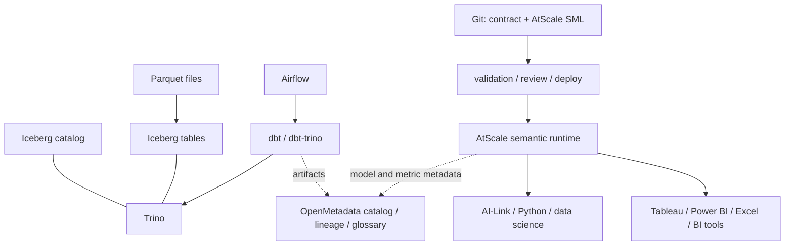

# 納入 AtScale 後的語意層架構重新評估

研究日期：2026-09-25。本文以 AtScale 官方文件重新檢視既有 Airflow、dbt、OpenMetadata、Iceberg、Trino、S3-compatible storage 與 Cube 設計。AtScale 的授權、內網部署版本與資料庫連接能力仍須在採購及 POC 階段確認。

## 結論

AtScale 應被評估為「正式語意執行與消費層候選」，而不是再增加一個與 Cube 並行的模型出口。它的 SML 是 YAML-based、可放在 Git repository、部署後讓 BI 工具連線；Design Center 提供視覺化建模。因此它更接近 BusinessObjects Universe 的「模型設計器 + 共用語意 runtime」需求。[SML 官方文件](https://documentation.atscale.com/container/creating-and-sharing-cubes/working-with-models-programmatically/sml)、[Design Center / Git 工作流](https://www.atscale.com/product/data-products/)

但「完全內網自管、特定開源要求」是關鍵限制。官方目前提供 container/Kubernetes 部署文件與明確的最低資源需求；POC 約需 16 CPU、64 GB RAM，production 建議三節點、每節點 16 CPU/64 GB RAM。這代表 AtScale 不是可隨手嵌入的 Python library，必須當成受治理的平台服務，並先核對授權與離線安裝條件。[Container 文件](https://documentation.atscale.com/)、[系統需求](https://documentation.atscale.com/container/product-requirements/minimum-system-requirements)

## 修訂後的目標架構

1. Airflow 只負責擷取、dbt、品質檢查、候選版本與發布順序；商業 SQL 留在 dbt。
2. Iceberg + Trino 保留為資料與 SQL 基礎層；AtScale 透過連線資料平台即時查詢，不把 OpenMetadata 當查詢引擎。
3. Git 中的權威契約與 AtScale SML 經 CI 驗證、審核後部署。若同時保留 Cube，必須是明確的 POC fallback，不能讓 AtScale 與 Cube 各自成為 metric authority。
4. OpenMetadata 負責搜尋、glossary、owner、品質與 lineage；它同步 AtScale/dbt 的已發布 metadata，但不再維護第二份公式。

## AtScale 帶來的能力

AtScale 官方將 semantic layer 定義為介於資料平台與 BI、notebook、AI 的共用層，集中管理 metrics、relationships 與 business logic；官方亦說明它會把工具查詢轉成資料平台 SQL，並可透過 aggregate/semantic acceleration 降低重複掃描。[Universal Semantic Layer](https://www.atscale.com/use-cases/universal-semantic-layer/)

SML 讓模型以 YAML objects 表達 dataset、dimension 等語意元件，並以 Git 作為來源；這與目前「模型編輯 UI → YAML/Git → 驗證與審核」方向相容。AtScale 也提供 Design Center，故可將自建 UI 降為契約審核、差異檢視與發布控制，而不必自行重做完整 Universe Designer。[SML](https://documentation.atscale.com/container/creating-and-sharing-cubes/working-with-models-programmatically/sml)、[Data Products](https://www.atscale.com/product/data-products/)

AtScale AI-Link 是 Python 的程式化介面，官方明確定位為在 data science、ML pipeline 與 code-oriented workflow 中使用語意層；它不是完整複製 Canvas 的建模體驗，但可讓 Python 使用已治理的模型。[AI-Link introduction](https://documentation.atscale.com/ailink-container/getting_started/introduction)

## 與原方案的取捨

| 面向 | Cube 自建路線 | AtScale 路線 |
|---|---|---|
| Universe 式建模 UI | 自建或採 Cube Cloud；自管 Core 不等於完整視覺化 Designer | Design Center 更接近現成模型編輯體驗 |
| Git/YAML | 自訂 schema 與 adapter | SML 原生以 YAML + Git 建模 |
| BI/Python 共用 | 需自行維護 SQL API、driver、Python client 契約 | 官方提供多種消費介面與 AI-Link，但須驗證版本與授權 |
| 開源與成本 | Cube Core 可採開源元件，平台責任較多 | AtScale 平台能力較完整，但不能假設為開源或零授權成本 |
| 內網自管 | 服務較小，仍需自行補治理與 UI | 有 container/Kubernetes 路線，但基礎資源與運維門檻較高 |
| 聚合加速 | 自行設計 pre-aggregations 與 cache | AtScale 的 semantic aggregation 是優勢，但需在 Trino/Iceberg 上做成本 POC |

## 建議決策

採用「AtScale-first POC、Cube 保留為 fallback」：以同一個 `sales.net_sales_event.v1` 契約，分別產生 AtScale SML 與既有 Cube adapter，使用固定的 fanout、退款、時間邊界、權限與 Python/BI 一致性案例比較。POC 必須回答：

- AtScale container 是否可在完全內網、無外部 CDN/呼叫的環境安裝與升級。
- 目前 AtScale 版本能否連接 Trino/Iceberg，以及是否支援本身使用的 S3-compatible storage。
- SML 與 Design Center 是否能表達 relationship cardinality、時間角色、semi-additive measures、row-level security 與聚合策略。
- Tableau/Power BI/Excel 及 Python/AI-Link 的同一 metric 是否得到相同結果。
- 授權是否允許所需的節點數、使用者數、AI-Link/BI connector、CI/CD 與 production support。

若任一項無法滿足「完全自管 + 開源要求」，退回 Cube Core 或其他可接受的自管語意引擎；此時保留 AtScale SML 的概念，但不要把 AtScale 專有模型格式當作平台權威契約。

## AtScale 與 Cube 的適用場景

兩者不是單純的「誰比較強」關係，而是產品重心不同：

| 場景 | 優先 AtScale | 優先 Cube |
|---|---|---|
| 多個 BI、Excel、notebook、AI agent 共用一套企業語意 | ✓ Universal semantic layer 的主要場景；AI-Link 可從 Python 以 feature/metric 名稱取數據 | 可做 API 層，但需自行整合各 BI、Python client、治理與模型發布 |
| 需要接近 Universe 的可視化建模體驗 | ✓ Design Center + SML/Git | Cube model 本身以 YAML/JavaScript 描述 cubes、views、joins；若要圖形 UI，通常要另建或採商業 UI |
| 內網自管且希望最大化開源、可自行掌握服務 | 只有在授權、container 安裝與支援條件通過時才適合 | ✓ Cube Core 的 headless API、SQL API、資料源與模型檔較適合自行組裝平台 |
| 將語意層嵌入自有 SaaS／產品，按請求產生 SQL 與快取 | 可行但平台資源、授權與隔離成本要先核算 | ✓ Cube 的 cubes/views、REST/SQL API、security context、cache/pre-aggregations 更貼近 embedded analytics |
| Trino + Iceberg lakehouse，工程團隊希望保留 SQL/dbt 主導權 | 需驗證 connector matrix 與 AtScale query/aggregate 行為 | ✓ Cube 有官方 Trino data source；仍需 POC 驗證 Iceberg、MinIO 與 pre-aggregation 目的地 |
| 資料科學家以 Python 探索治理後的 features | ✓ AI-Link 直接提供 Python 操作與 DataFrame 工作流 | 可使用 Cube SQL/API，但 Python 語意包裝、結果型別與 feature workflow 多半要自行建置 |

Cube 官方模型將 measures、dimensions、joins、pre-aggregations、access policies 放在 cube/view 定義中，並提供 data source、public visibility 與 refresh key 等服務層控制。[Cube cubes](https://docs.cube.dev/reference/data-modeling/cube)

因此本案建議採「分層而非雙主權」：

1. **資料產品層**維持 Airflow + dbt-trino + Iceberg + Trino。
2. **企業 Universal semantic layer 候選**使用 AtScale，前提是商業授權與完全內網 POC 通過；它負責跨 BI、Python、AI 的共同語意與模型體驗。
3. **自管 embedded analytics / fallback runtime**使用 Cube；它負責產品內嵌查詢、REST/SQL API、細緻的 cache/pre-aggregation 與自有服務整合。
4. **契約層只維護一份**：業務 metric/relationship contract 存在 Git；AtScale SML 與 Cube YAML 都是由 adapter 產生或通過一致性測試的 runtime binding，不能各自編輯公式。
5. **OpenMetadata 只做 catalog/governance**：同步兩個 runtime 的已發布 metadata、owner、lineage、品質與版本，不作第三個 query engine。

這樣的分工避免用 Cube 解決它不擅長的企業級跨工具治理，也避免用 AtScale 承擔不必要的產品內嵌與完全開源自管風險。正式選型仍須以同一組 metric golden tests 比較結果、延遲、成本、權限隔離與回滾能力。

## 重要限制

本研究未宣稱 AtScale 對本環境的 Trino/Iceberg/MinIO 組合已驗證，也未把官方行銷頁的支援描述當成開源授權承諾。正式選型前應取得版本化 connector matrix、離線安裝包、授權條款、資源估算與安全架構文件，並以可重現的 POC 結果更新 ADR。
