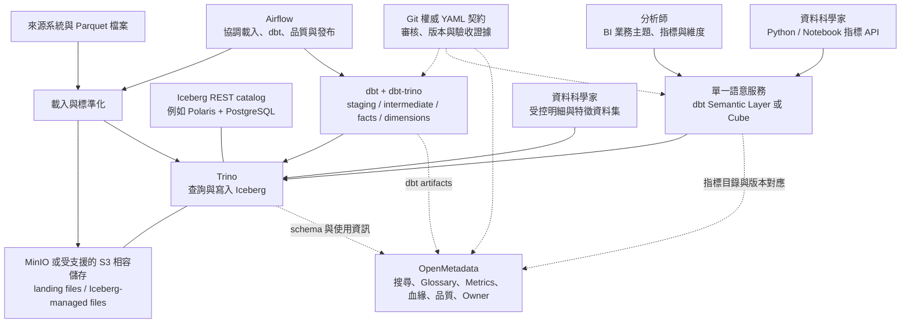
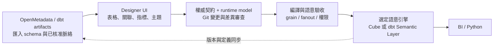

# 用 Airflow、dbt、OpenMetadata、Iceberg、Trino 與 MinIO 建構 Universe 式分析架構

研究日期：2026-09-25。狀態：研究提案，尚未部署、未完成 POC、不是已核准的需求資料契約或可執行資料契約。以下以「已確認」表示官方文件或原始碼可支持的產品事實；「建議」表示架構判斷；「待 POC」表示必須在所選版本、授權方案、資料與客戶端實測。

## 1. 建議結論

這套組合可以成為一致、可治理且容易維護的分析平台；但僅把七項技術串在一起，還不會自動得到 BusinessObjects Universe 的使用體驗。必須補上兩個明確角色：**Iceberg catalog** 管理表格提交與 metadata 指標；**可執行語意服務** 將核准的指標、維度、時間語意與 join 規則轉成查詢。OpenMetadata 提供發現、定義、Owner、品質及血緣，不能因為它能保存公式，就假設它會在分析師每次查詢時執行同一套指標規則。

建議先做共同底座，再從下列兩條語意路線選一條當正式計算入口，避免在兩個引擎各維護一份公式：

| 條件 | 建議路線 | 主要理由與代價 |
| --- | --- | --- |
| 可接受 dbt 託管服務與方案費用，希望公式和 dbt 工作流程接近 | **dbt Semantic Layer / MetricFlow → Trino** | 官方目前已列 Trino 支援；可用官方 Python SDK 和 BI 整合。須驗證內網連通、實際方案、權限與所選 BI；dbt Core 本身不包含託管 APIs。 |
| 必須內網自管，或需要 Postgres 相容 SQL 端點搭配既有 BI | **Cube Core 或合適的 Cube 商業部署 → Trino** | 官方有 Trino datasource 與 Core SQL API；Cube views 可整理業務主題。代價是額外維運服務與 dbt／Cube 模型對應。 |
| 初期人力很少，只有少數固定報表 | **dbt marts / 認證 SQL views → Trino → BI** | 作為第一階段可行，但動態跨維度指標、join 正確性與跨工具一致性仍需自行管控；不應宣稱已完整替代 Universe。 |

前兩條的支援依據分別見 [dbt SL 支援矩陣](https://docs.getdbt.com/docs/use-dbt-semantic-layer/sl-faqs)、[Cube Trino datasource](https://docs.cube.dev/admin/connect-to-data/data-sources/trino)、[Cube Core SQL API](https://docs.cube.dev/reference/core-data-apis/sql-api)。選型是條件式建議，並非認定任何一套對所有組織都最省成本。 若將類 Universe Designer 的圖形化模型／關聯編輯列為必要條件，優先評估第 14 節的 Cube Cloud Visual Modeler，並分別確認編輯 UI 與查詢 runtime 的部署及授權。

**儲存選型需更新：**MinIO 開源 repository 已於 2026-04-25 封存，官方 README 表示不再維護。若要新建正式環境，應先確認可持續支持的 MinIO／AIStor 部署或其他經驗證的 S3 相容儲存；詳見第 8 節。[MinIO 官方狀態](https://github.com/minio/minio)

## 2. 架構分工與資料流

以下為設計圖。實線是處理或查詢路徑，虛線是 metadata／定義發布；語意服務框只選一個正式實作。



**建議的邏輯邊界：**資料列的清洗、去重、幣別換算、事件分類與可重用欄位由 dbt 處理；切片後的 aggregation、ratio、時間比較與允許的 join 由語意引擎處理；OpenMetadata 呈現其已發布定義與證據。凡同一邏輯必須出現在多處，應由權威定義產生或建立自動一致性檢查，而非期待人工同步。

Airflow 的成功狀態應表示「這個資料產品完成指定的發布條件」，不能直接等同業務定義正確。分析師與科學家也不應直接以 bucket 中的 Parquet 路徑作正式指標入口；那會繞過表格版本、權限與語意發布。

## 3. 與 BusinessObjects Universe 對應

**已確認：**SAP 將 relational universe 分成 business layer、data foundation 與 connections；business layer 的 objects 包含 dimensions、hierarchies、measures、attributes、conditions，讓使用者以業務語言組織分析。這是本提案的能力基準，不是要複製 `.unx` 格式。[SAP Universe 定義](https://help.sap.com/docs/SAP_BUSINESSOBJECTS_BUSINESS_INTELLIGENCE_PLATFORM/4359a0ef221e4a1098bae432bdd982c1/45f056536e041014910aba7db0e91070.html)、[SAP Business layers](https://help.sap.com/docs/SAP_BUSINESSOBJECTS_BUSINESS_INTELLIGENCE_PLATFORM/3d4f417fd0764f909c0ef7931e19fe1a/466df4e26e041014910aba7db0e91070.html)

| Universe 使用者期待 | 本架構對應（建議） | 驗收重點 |
| --- | --- | --- |
| 用營收、有效客戶、月份查詢 | 核准 metric IDs、中文顯示名稱、同義詞與時間維度 | BI 與 Python 選同一指標，無需重寫公式 |
| 不必知道底層資料表 | dbt facts/dimensions + 語意模型或 Cube views | UI 呈現業務主題；原始欄位不干擾一般分析 |
| join 不造成重複計算 | 宣告 entities/keys/cardinality、限定 join 路徑與可分析維度 | 一對多、兩個 facts、橋接表、退貨案例結果正確 |
| 知道何時可加總 | 定義 additive / semi-additive / non-additive 與時間邊界 | 月活躍用戶不直接加成季活躍；比率重新算分子分母 |
| 安全與可追溯 | 身分、Trino 權限、語意權限、目錄與審計關聯 | 角色切換、快取、直連路徑皆測試 |
| 找得到可信定義 | OpenMetadata Glossary / Metric + 契約、Owner、血緣 | 定義、發布版本、最後成功批次及品質狀態可查 |

這是組合式架構，因此仍需選擇 BI／探索前端。語意 API 本身不等於分析師的拖放式介面；LOV、prompt、hierarchy drill-down、中文 label 和日期篩選必須以實際前端驗收。

## 4. dbt-trino、MetricFlow 與 dbt Semantic Layer 的正確區分

**已確認：**`dbt-trino` 是由 Starburst 維護的 dbt adapter，支援連線到 Trino 與 Starburst；dbt 透過它產出／執行資料轉換 SQL。官方指出，materialization 所在的 Trino connector 必須支援建表。這證明 transformation 連通，不能單獨證明任何 semantic API 的可用性。[dbt Trino setup](https://docs.getdbt.com/docs/local/connect-data-platform/trino-setup)

**已確認且容易被舊資料誤導：**截至本次查證，dbt Semantic Layer FAQ 與 setup 均明列 **Trino**；因此「dbt SL 不支援 Trino」已不適合作為此研究的結論。託管 SL 需要 Starter、Enterprise 或 Enterprise+ 方案；本機 MetricFlow 能編譯／查詢，不等同擁有託管 API 與所有整合。[dbt SL FAQ](https://docs.getdbt.com/docs/use-dbt-semantic-layer/sl-faqs)、[dbt SL setup](https://docs.getdbt.com/docs/use-dbt-semantic-layer/setup-sl)

**已確認：**MetricFlow repository 說明它是 metric-to-SQL compilation library，需搭配 dbt project 和 adapter。其授權有版本差異：0.209.0 起為 Apache 2.0，較舊系列曾用 AGPL／BSL；不可籠統把所有版本都稱為相同授權。[MetricFlow 原始碼與 License history](https://github.com/dbt-labs/metricflow)

**建議：**若選託管 dbt SL，直接以它作 metric 執行權威，OpenMetadata 只同步目錄；不要再把同一 metric 手動翻成 Cube 公式。若堅持完全自管，單純架起 MetricFlow library 仍需自己補 API、身分／授權、併發、快取、BI driver 相容與維運，不把這些視為免費附帶功能。

**待 POC：**鎖定 dbt engine、`dbt-trino`、MetricFlow、Trino 與 OpenMetadata ingestion 的相容組合；不得由「支援 Trino」推論所有版本、驗證方式及 Starburst 商業功能都一致。對這個自管底座，保守起點是相容的 dbt Core v1 與 JSON artifacts；dbt v2 路線另驗 adapter 與 artifacts 格式。

### 分析師與資料科學家怎麼共用

**已確認：**dbt SL 提供 GraphQL、JDBC 與 Python SDK。JDBC 使用 Arrow Flight SQL，而不是 Trino JDBC；通用 JDBC 客戶端仍需支援所需 driver，不能只因某 BI 能連 Trino 就保證能連 dbt SL。[dbt SL APIs](https://docs.getdbt.com/docs/dbt-apis/sl-api-overview)、[dbt SL JDBC](https://docs.getdbt.com/docs/dbt-apis/sl-jdbc)

**已確認：**Python SDK 查詢結果為 PyArrow Table，可轉成 pandas 或 Polars。資料科學家可以取同一個核准指標，避免在 notebook 重寫營收或活躍用戶的判斷。[dbt SL Python SDK](https://docs.getdbt.com/docs/dbt-apis/sl-python)

**建議：**保留第二條「受控明細／特徵資料集 → Trino」路徑給 ML。指標服務不必承擔全部訓練資料抽取；但明細資料產品必須追溯同一 customer 定義、時間區間與契約版本。feature label、觀察窗口及 point-in-time correctness 另外定義，不能直接把儀表板的當期數字當訓練標籤。

### dbt SL 權限與快取限制

**已確認：**service token 對應的底層 credential 決定資料存取權；Starter 每個 project 一組 credential，Enterprise 系列可用多組。官方 setup 也提醒：從已物化的 cache 取資料時，不會在查詢當下套用底層表的 security context。[dbt SL credentials 與 caching FAQ](https://docs.getdbt.com/docs/use-dbt-semantic-layer/setup-sl)

**建議／待 POC：**不要用同一高權限 service token 對所有人提供不同資料範圍。第一版可先停用涉及角色隔離的共享 cache；待各角色、各租戶、cache hit/miss 與撤權測試通過後再啟用。亦須確認 dbt 託管端到內網 Trino 的受支援連線方案。

## 5. Cube 路線：接近 Universe 的主題介面，但不是零配置

**已確認：**Cube 官方 Trino connector 使用共用 Presto driver，提供 Trino type、catalog、schema、SSL 及 token 等設定；這是 Cube 接 Trino 的直接支援證據。Trino pre-aggregation 預設使用 simple build；文件列出的 export bucket 是 AWS S3/GCS，不能由這段直接宣稱 MinIO export 已驗證。[Cube Trino datasource](https://docs.cube.dev/admin/connect-to-data/data-sources/trino)

**已確認：**Cube cubes 可宣告 measures、dimensions、joins、pre-aggregations 及 access policies；views 在其上組合可公開的 members 與 join paths，適合整理「銷售」「客戶」「庫存」等主題。Views 是 façade，不是另建一套資料表。[Cube cubes](https://docs.cube.dev/reference/data-modeling/cube)、[Cube views](https://docs.cube.dev/reference/data-modeling/view)

**已確認：**Cube 用宣告的 cardinality 和 primary keys 處理 fan/chasm traps；多條可行路徑時，文件建議使用 views 固定 join path。**建議：**仍要由 dbt 測 key 唯一性、有效期間與 join 結果；引擎無法替錯誤宣告或錯誤業務分攤規則兜底。[Cube joins](https://docs.cube.dev/reference/data-modeling/joins)

**已確認：**Cube Core 有 Postgres protocol SQL API，預設關閉，設定 SQL port 與 credentials 後可啟用；不是僅 Cube Cloud 才有 SQL API。支援的是其語意模型上的 SQL 範圍，不能當成完整 PostgreSQL 或 Trino。**建議：**Python 可用 Postgres 相容客戶端消費此端點，實際 driver、型別、分頁／streaming 與大結果集仍列 POC。[Cube SQL API](https://docs.cube.dev/reference/core-data-apis/sql-api)、[SQL query format](https://docs.cube.dev/reference/core-data-apis/sql-api/query-format)

**已確認：**Cube access policies 包含 row/member 控制；Cloud 的 `userAttributes` 在 Core 不可直接使用，Core 應使用驗證後的 `securityContext`。**建議：**外部身分只經可信驗證入口映射，不能信任客戶端自行送的 tenant ID；語意層限制不會自動限制使用者另行直連 Trino。[Cube access policies](https://docs.cube.dev/reference/data-modeling/data-access-policies)

**已確認：**Cube repository 根授權以 Apache 2.0 為預設，部分檔案／package 為 MIT；商業產品能力與此不同。目前 pricing 將企業 SSO、Audit Logging、Advanced Networking 等列入 Enterprise。**建議：**採購／自管選型列出真正需要的管理能力，不由 open-source license 推定 Cloud 管理介面、SSO 或 SLA 都免費；所選 package/image 的 LICENSE 仍應在版本鎖定時核對。[Cube 原始碼 LICENSE](https://github.com/cube-js/cube/blob/master/LICENSE)、[Cube pricing 功能矩陣](https://cube.dev/pricing)

## 6. OpenMetadata：共同語言、血緣與認證，不是另一份計算權威

**已確認：**OpenMetadata 的 dbt ingestion 能讀取 dbt artifacts，關聯 models、lineage、tests、tags、owners、descriptions 及 glossary terms；可從已儲存 artifacts 或 dbt Cloud APIs 取得。官方列 `manifest.json` 為必要，`catalog.json`／`run_results.json` 用於額外 metadata／測試結果。因此 Airflow 完成 dbt 後，應保存並發布同批 artifact，而非讓目錄隨機抓不同 run 的檔案。[OpenMetadata dbt workflow](https://docs.open-metadata.org/v1.12.x/connectors/database/dbt/configure-dbt-workflow)

**已確認：**OpenMetadata 已有 Metric entity，可記錄 formula/code、unit、granularity、Owner 與關聯；並非只能拿 glossary 代替 metric。原始碼也有 expression、dimensions、measures 等 schema。**邊界推論：**這些是 metadata model 的證據，不是任意 BI 查詢會經它生成 join／執行 SQL 的證據；本架構仍由選定的 dbt SL 或 Cube 執行語意查詢。[OpenMetadata Metrics 指南（snapshot 文件）](https://docs.open-metadata.org/v1.13.x-SNAPSHOT/how-to-guides/data-governance/metrics)、[Metric entity 原始碼](https://github.com/open-metadata/OpenMetadata/blob/main/openmetadata-spec/src/main/resources/json/schema/entity/data/metric.json)

**待 POC：**所選 OpenMetadata 發布版本是否原生完整匯入所選 dbt semantic spec／Cube model，不可由「支援 dbt models」直接推論。若不足，可建單向同步器：以穩定 metric ID、contract version、source Git SHA、runtime object name、Owner 及 lineage 更新目錄；採 deterministic mapping、dry-run diff、可重跑的 upsert 與刪除／淘汰規則。Snapshot／main 分支 schema 只用於能力研究，不作正式部署版本承諾。

### 避免三份定義各自漂移

此儲存庫已決議以 YAML 為權威需求資料契約，Markdown 是閱讀呈現，且進入可開發／核准狀態須經版本控制中的契約審核請求。本文遵循此原則，但不把研究內容直接升級為 approved contract。[ADR 0004](../adr/0004-yaml-is-the-authoritative-contract.md)、[ADR 0011](../adr/0011-version-controlled-contract-review-and-validation.md)

**建議發布機制：**

1. 分析師／驗收 Owner 定義指標含義、允許維度與驗收例；工程師確認可執行資料契約，資料契約仲裁者處理來源、粒度與可行性歧見。
2. 契約審核請求保存權威 YAML、生成的 Markdown、dbt 與語意模型變更、測試與核准證據。
3. 將同一 metric ID 映射到 runtime model 與 OpenMetadata；OpenMetadata UI 中的業務變更回到審核請求，不能直接變成第二條發布管道。
4. CI 比較契約宣告、runtime metadata 與目錄發布內容；差異阻擋認證。真正的公式只在選定的 runtime 實作一次，對其語意等價性用驗收資料驗證。
5. 共同驗證窗口通過後，再由驗收 Owner 依事前核准案例完成正式 UAT；暫定通過不得顯示為正式認證。

## 7. 語意服務選型 POC 必須回答的問題

| 題目 | 可判定的成果 |
| --- | --- |
| 真正簡單易用嗎？ | 指定一套 BI，分析師以中文名稱選指標＋維度＋日期，無需新寫 SQL／公式；科學家從 notebook 得相同結果。 |
| Trino 支援在本環境成立嗎？ | 固定版本與權限後實際 query；涵蓋 decimals、timestamp/time zone、NULL、中文 label、日期邊界。 |
| 彙總與 join 是否正確？ | 預先核准的金額、distinct、ratio、快照庫存、退款、一對多及多 fact 案例皆一致。 |
| 安全有無旁路？ | BI、API、SQL、Trino 直連與快取各路徑的兩個角色結果／拒絕行為符合契約。 |
| 定義發布能回滾嗎？ | 同一 release ID 可追溯 dbt artifact、語意版本、契約與目錄；新舊版本並行與撤回演練成功。 |
| 符合維護成本嗎？ | 記錄新增一個指標需改哪些檔、誰批准、CI 時間、排錯時間與持續服務成本。 |

## 8. 基礎建設：把 Parquet 檔案變成可治理的分析資料

以下為本研究的架構建議，尚未部署或實測。先假設是企業內網、批次或微批次更新、以 SQL 分析為主；資料量、BI 產品、併發、更新 SLA 與是否允許託管服務仍未指定，不據此給硬體容量或成本承諾。

### Parquet、Iceberg、兩種 catalog 各自負責什麼

使用者所說的「Parquet documents」，本文解讀為 **Parquet 資料檔**。Parquet 是欄式檔案格式；Iceberg 在其上管理表格 metadata、快照與提交；MinIO 提供物件儲存。Iceberg 的 manifest 等 metadata 並非全部都是 Parquet，不能要求整個 warehouse 只有 `.parquet`。[Parquet 官方概述](https://parquet.apache.org/) [Iceberg table specification](https://iceberg.apache.org/spec/)

| 層次 | 建議元件 | 責任與邊界 |
| --- | --- | --- |
| 資料檔案 | Parquet on S3-compatible storage | 儲存列與欄，不負責營收定義、join 路徑或使用者權限。 |
| 表格交易 | Iceberg | 維持單張表的快照、一致讀取與原子提交；不要推論整個 dbt DAG 自動具有跨表原子性。 |
| 交易目錄 | Iceberg REST catalog，例如 Apache Polaris | 記錄與定位表格 metadata，協調 catalog 操作；持久化後端另行管理。 |
| SQL 執行 | Trino | 向交易目錄解析表格，再直接讀寫物件儲存；資料內容不需要經 OpenMetadata 中轉。 |
| 治理目錄 | OpenMetadata | 提供搜尋、術語、owner、品質與 lineage；它不替代上述 Iceberg 交易目錄。 |

Iceberg 官方說明以 metadata pointer 的原子替換形成表級提交；Trino 則要求可用的 metastore/catalog 與儲存連線。因此「MinIO 上放一個 Parquet 資料夾，再讓 OpenMetadata 掃描」仍不足以得到 Iceberg 表。[Iceberg reliability](https://iceberg.apache.org/docs/latest/reliability/) [Trino metastores](https://trino.io/docs/current/object-storage/metastores.html)

**建議新建環境採一套 REST catalog。** Polaris 是可評估的實作，生產持久化可採 PostgreSQL；官方亦有 S3-compatible storage 設定。若已經有穩定 HMS，可沿用並評估 REST 遷移，第一期不必同時部署多套交易目錄。Polaris、Trino、儲存端的 endpoint、TLS、身分與 credential vending 必須共同驗證；各產品支援 S3，不代表所有授權流程任意組合即可通。[Polaris persistence](https://polaris.apache.org/releases/1.7.0/helm-chart/persistence/) [Polaris S3 configuration](https://polaris.apache.org/releases/1.7.0/configuration/configuring-polaris-for-production/configuring-aws-s3-cloud-storage-specific/)

### MinIO 的現況會改變選型

截至 2026-09-25，`minio/minio` 官方 repository 顯示 **2026-04-25 已封存**，README 明示不再維護，並指向 AIStor Free（standalone）與 AIStor Enterprise（distributed）。這不是對所有 MinIO 商業產品停止維護的推論。[MinIO 官方 repository](https://github.com/minio/minio)

建議仍把「S3-compatible storage」保留為架構邊界：已有 MinIO 可用來做 POC，但新建正式環境先確認可持續維護的 MinIO／AIStor 版本、部署形態與支持方案；若不符合內網、開源或預算要求，另選並驗證相容儲存。Trino 官方說明其 S3 相容測試涵蓋 AWS S3 與 MinIO；切換其他產品需要自己的相容測試。不要把某個既有 `minio:latest` 映像當長期交付策略。[Trino S3 filesystem](https://trino.io/docs/current/object-storage/file-system-s3.html)

### 匯入、轉換與發布流程

建議資料路徑：`landing → raw Iceberg → staging → conformed marts → semantic serving`。這是邏輯分層，依資料價值決定是否實體化，不要求每層複製全量資料。

1. **落地與驗證。** 來源擷取程式將不可變批次寫到 landing；記錄來源 watermark、批次 ID、檔案清單、schema fingerprint。Airflow 排程擷取程式，不等於自動具備 CDC。既有 Parquet 先驗證 decimal、timestamp/timezone、欄位型別、schema 演進與重複批次。
2. **提交 Iceberg。** 第一個 POC 建議讀取 staging/external table，再透過 Trino `INSERT`／CTAS 寫入 Iceberg；既有大量 Parquet 才評估檔案匯入程序。Trino 的 `add_files` 須啟用，而且不替你驗證來源檔 schema 相容性；它也不是完整的 CDC 或去重機制。[Trino Iceberg connector](https://trino.io/docs/current/connector/iceberg.html#add-files)
3. **dbt 轉換。** 用 `dbt-trino` 編譯與執行 staging、事實表、共用維度和品質測試。對有更新的事實表可評估 `merge` + `unique_key`；先在來源批次去重，並明定刪除、遲到資料與重算範圍，不能只靠 `max(event_time)`。dbt 的 `unique_key` 是合併設定，須另以測試驗證資料唯一性。[dbt Trino configurations](https://docs.getdbt.com/reference/resource-configs/trino-configs) [dbt SQL models](https://docs.getdbt.com/docs/build/sql-models)
4. **驗證候選版本。** 檢查金額、主鍵、關聯與跨工具結果；將測試通過的資料批次與語意版本配成 release。
5. **發布與同步。** 發布 semantic 版本，更新可查詢的資料 release，將 artifacts、品質結果及版本連結送 OpenMetadata，再更新快取。發布失敗要能保留上一個完整版本。

「`dbt build` 後才讓使用者看到新資料」需要額外設計：若直接改動已公開 marts，測試前使用者就可能看見新資料。建議重要產品以候選 schema/table、不可變 release 或固定快照集合驗證後，再切換服務端的 release 指標；切換機制與 cache key 由實作負責，不宣稱 dbt／Iceberg 自動提供全 DAG 的原子發布。

Airflow DAG 只承擔依賴、重試、超時與發布控制；商業 SQL 留在 dbt，指標聚合留在選定的 semantic runtime。任務重跑需結果一致，XCom 傳批次 ID、artifact URI 和 snapshot 清單，不傳大型 DataFrame。這符合 Airflow 官方的 idempotent task 與 remote storage 建議。[Airflow best practices](https://airflow.apache.org/docs/apache-airflow/stable/best-practices.html)

## 9. 用一個「淨銷售額」案例驗證商業一致性

以下是**示例需求與可執行資料契約的設計草案**，不是已核准的會計定義，也不是能直接交給 dbt／Cube 執行的原生 YAML。

### 先定義 grain、時間與合法切分

| 資料產品 | 一筆資料代表什麼 | 設計重點 |
| --- | --- | --- |
| `fct_order_line` | 一筆訂單明細 | 訂單幣別金額與報表幣別金額分開；折扣分攤在 dbt 完成。 |
| `fct_refund_line` | 一筆退款明細事件 | 同一訂單明細可有多次退款；退款狀態與日期明確。 |
| `fct_sales_event` | 一筆已成立銷售或退款事件 | 銷售正數、退款負數；退款歸退款日，明確命名為本方案事件口徑。 |
| `dim_customer_version` | 一名客戶在一個有效期間的版本 | 在資料處理時根據事件時間選對版本，驗證有效區間不重疊。 |
| `fct_inventory_daily` | 商品 × 倉庫 × 日的庫存快照 | 庫存可跨商品加總，不可把每日快照沿時間直接相加。 |

**商業一致不代表強迫不同概念共用同一名字。** 本例 `net_sales_event_v1` 按事件發生日認列；若管理者要「退款回沖原訂單月份」，那是另一個明確命名的 metric 或新版本。若用途是正式財務營收，還需業務決策 Owner 核准認列規則，不能把訂單額默認成會計營收。

### 必須抓到的 fanout 錯誤

假設訂單明細 A 銷售 1,000 元，有兩筆退款 100、50 元。直接把 order line join refund line 再 `SUM(sales) - SUM(refund)`，會得到 `2,000 - 150 = 1,850`，正確值應是 **850**。修法是在指定 grain 預聚合退款，或將銷售／退款建成可加總的事件流。`SUM(DISTINCT amount)` 不是通用修法，因為兩個不同訂單可能有一樣金額。

跨事實表（銷售、退款、廣告費）分析，先在各自語意模型聚合到共用維度，再合併結果；如果退款沒有 campaign 歸因，不能開放 campaign 切分卻讓系統暗中分攤。主鍵、合法 join、時間角色與允許維度共同構成 semantic layer 的核心。

示例權威需求契約欄位如下；正式採用時應使用 repository 既定 schema，經契約審核請求與 UAT 流程核准。語意引擎內的可執行公式只有一份，契約用穩定 ID 與 binding 指向它，避免此 YAML、OpenMetadata 與 BI 各自維護算式。

```yaml
contract_id: sales.net_sales_event.v1
status: draft
business_name: 淨銷售額（事件日口徑）
acceptance_owner: 待指定
grain: sales_event_id
time_semantics:
  dimension: event_business_date
  timezone: Asia/Taipei
  refunds: recognized_on_refund_date
money:
  reporting_currency: TWD
  tax: excluded
  rounding: round_after_aggregation_to_2_decimals
allowed_dimensions: [event_business_date, channel, customer_region_at_event]
aggregation: additive
implementation_binding:
  engine: 待選定_dbt_semantic_layer_或_cube
  metric_id: net_sales_event_v1
acceptance_cases: [sale_1000_refunds_100_50_equals_850, cross_month_refund]
```

dbt 物理模型負責產生 `signed_net_amount_twd`，包括成立狀態、稅額、折扣、匯率與退款符號；選定的 semantic runtime 只宣告對它的聚合與合法維度。平均客單價要從相同範圍的分子／分母計算，不能平均各群組已算好的平均值；不重複客戶數也不能把每日 distinct count 直接相加。分母若用「成立訂單數」而分子含退款事件，須明示是特定商業口徑，不能任意混用。

### 分析師與資料科學家的兩個入口

**標準 KPI 入口：** 分析師在 BI 選「淨銷售額、月份、通路」，資料科學家由 Python 呼叫同一個 metric API／受支援連線；兩者使用同一 metric ID、版本、時區、filter、授權範圍與資料 release。使用者不用知道 bucket、Iceberg partition 或來源欄位名稱。

**明細探索入口：** 資料科學家透過 Trino 讀經授權的明細 marts、做特徵與實驗。實驗公式可以存在，但要標示為 exploratory；成為共享 KPI 前，必須回到契約、測試與語意發布流程。明細資料與指標結果可共享底層事實，但任意 Python 計算不會自動得到「指標定義一致」保證。

訓練資料另需防止資料洩漏：除了事件時間，還要保存資料當時何時可取得；用 `available_at <= prediction_time` 等契約規則建立 point-in-time dataset。Iceberg time travel 有助歷史讀取，但不能自行判定業務上何時已知某資訊，也不能代替特徵工程規則。建議保留 feature SQL Git SHA、每張來源表 snapshot ID、cutoff 與輸出版本。[Trino historical snapshots](https://trino.io/docs/current/connector/iceberg.html#time-travel-queries)

## 10. 維運設計：降低工程師日常維護負擔

### 依賴與責任要可分離

建議平台團隊維護儲存、REST catalog、Trino、Airflow 與備援；analytics engineering 維護 dbt 模型與 semantic 實作；驗收 Owner 負責業務案例與 UAT；資料契約仲裁者裁決來源、粒度、時點與定義衝突。每個 domain 只暴露少量穩定的 certified data products，不把所有 raw tables 都包成使用者物件。

Airflow、OpenMetadata ingestion 與 dbt runner 使用獨立且固定版本的執行環境；分享整套 Python 環境容易讓 adapter/provider 升級互相牽動。OpenMetadata 自身還有 metadata database、search backend 等部署依賴，這些均需計入平台維運，不只計算使用者列出的六個元件。[OpenMetadata deployment](https://docs.open-metadata.org/latest/deployment)

| 項目 | 本方案的維運規則／需驗證事項 |
| --- | --- |
| 版本 | 鎖定 Trino、catalog、Iceberg table format、dbt runtime、dbt-trino、OpenMetadata ingestion 與 semantic runtime 的相容組合。不是每套各取 latest。 |
| dbt artifacts | JSON artifact ingestion 路線先採已驗證的 dbt Core v1／adapter 組合。dbt v2 docs 有新的 Parquet artifacts，不得未驗證就假設 OpenMetadata 舊 JSON ingestion 完全通用。這與業務資料採 Parquet 是兩件事。[dbt docs v2](https://docs.getdbt.com/reference/commands/cmd-docs?version=2) |
| 預彙總 | REST catalog 路線優先用 dbt table／incremental 或所選 semantic engine 的快取；Trino 官方列出 REST catalog 不支援 materialized view management，不能只看 connector 整體功能便預設可用。[Trino REST catalog](https://trino.io/docs/current/object-storage/metastores.html#rest-catalog) |
| 檔案整理 | 依檔案數／大小與查詢指標觸發 compaction、manifest maintenance、snapshot expiration；維護有資源與時間預算。 |
| 保留政策 | snapshot 保留期需覆蓋回補、長查詢、訓練重現與 UAT；孤兒檔清除門檻要大於最長寫入時間。不要對 Iceberg 管理中的資料 prefix 套任意 S3 自動刪除規則。[Iceberg maintenance](https://iceberg.apache.org/docs/latest/maintenance/) |
| 發布證據 | 每次 release 留下 contract version、dbt Git SHA、semantic Git SHA、artifact hashes、各表 snapshot ID、source cutoff、test results；跨表快照集合由 release 記錄協調。 |
| 回復 | 回復上一個 semantic 版本仍須配對可讀取的資料 release。備份 catalog database、必要物件、政策與設定，演練整組恢復；只有備份 Parquet 不夠。 |
| 性能 | 將 batch/dbt、interactive BI、DS exploration 分成 Trino resource groups，限制併發、排隊與掃描量；需要更強隔離時再拆叢集。[Trino resource groups](https://trino.io/docs/current/admin/resource-groups.html) |

### 權限必須在實際查詢路徑生效

設計上要同時關閉繞過路徑：一般 BI 使用者不能拿高權限帳號直讀 raw bucket；OpenMetadata 的 glossary、PII tag、certification 是治理訊號，只有政策部署到執行系統才會限制資料。

Trino 可設定 row filter、column mask 與表級操作權限。但若 semantic service 全部共用一個服務帳號，Trino 看見的通常是服務身分，不能假設自動識別每位 BI 使用者。需驗證身分傳遞，或按安全域分離服務憑證並由 semantic runtime 執行受信任政策；直連 DS 帳號另受 Trino 政策控制。快取也必須按授權範圍隔離。[Trino file-based access control](https://trino.io/docs/current/security/file-system-access-control.html)

政策的跨引擎一致性靠測試證明：用兩個不同部門帳號查相同 metric，再嘗試用 SQL／API／MinIO 路徑越權；預期值和拒絕結果都納入 UAT。這是部署驗證項目，不能以 catalog 上「已認證」字樣替代。

## 11. POC 與分期交付：先證明一致，再擴展 domain

以下是建議交付階段與驗收條件，不是已完成的測試結果或固定工期。

| 階段 | 交付物 | 通過條件 |
| --- | --- | --- |
| 0：定義與選型 | 3–5 個 KPI 的草稿契約、目標 BI／Python 用戶端、部署邊界、版本矩陣 | 同意事件日／認列日、grain、幣別、退款與可切分維度；確認託管／自管路線。 |
| 1：資料底座 | 1 個 domain 的 Parquet → Iceberg → dbt → Trino；有持久化 catalog | 同批次重跑不增加筆數；更新與刪除正確；服務重啟不遺失表格；可讀指定快照。 |
| 2：語意入口 | 一種 runtime，串接一個 BI 與 Python；OpenMetadata 可發現 | 相同參數、身分與 release 的 KPI 結果一致；無效維度／join 明確拒絕。 |
| 3：發布與維運 | CI、候選版本、語意發布、權限測試、復原演練、監控 | 測試失敗不污染 certified release；回復能重現前版結果；併發／資料量達商定 SLO。 |
| 4：逐域擴充 | 更多共用維度、指標與使用者 | 每個 domain 有驗收 Owner、支持責任與受控淘汰流程。 |

建議建立小型 golden dataset，至少包含：

| 驗收案例 | 必須成立的結果 |
| --- | --- |
| 一筆銷售 1,000，兩筆退款 100、50 | 淨額 850，任何合法 join 都不放大。 |
| 兩筆不同訂單各 1,000 | 總額 2,000，不能用 `SUM(DISTINCT amount)` 誤去重。 |
| 9 月銷售、10 月退款 | 依指定事件日口徑分別落月；與回沖口徑分開命名。 |
| 相同 UTC 時刻跨臺北日期邊界 | BI 與 Python 落在相同 business date。 |
| 客戶搬遷／維度 SCD2 變化 | 歷史歸屬與當前歸屬按 metric 設計分開；不重複匹配。 |
| 月底庫存／不重複客戶／平均值 | 使用相應非加總規則，不從每日展示值直接相加或平均。 |
| 重跑、遲到更新、刪除、重複批次 | 與指定重算基準一致；不憑「任務成功」判定資料正確。 |
| 不同部門權限與共用快取 | 無跨部門洩漏；BI、API、SQL 的授權範圍一致。 |
| 一張事實表已更新、維度尚未完成 | certified endpoint 仍提供前一完整 release，或明確拒絕。 |
| 指標 v2 更改退款規則 | v1 持續可重現，v2 另行 UAT，完成下游遷移才受控淘汰。 |

性能測試應分冷快取、熱快取、dbt 併跑和不同併發量，量測端到端 p50/p95、掃描量、排隊時間與 freshness。可由業務訂定如「常用互動查詢 p95 低於 5 秒」的候選目標，但本研究沒有硬體與資料分布，不能把它當產品保證。

正式選型前仍需補齊：現用 BI 及版本、是否內網隔離／允許結果經託管服務、日增量與總量、互動併發、更新頻率、保留年限、既有 MinIO 支持情況，以及團隊可承擔的值班與維運責任。這些資訊影響部署與產品選擇，不影響本報告對 grain、單一公式權威與可驗證發布的要求。

## 12. 與本 repository 的治理規則銜接

本報告是研究與設計建議，不是 `approved` 的需求資料契約。正式交付應遵守 [YAML 權威契約](../adr/0004-yaml-is-the-authoritative-contract.md)、[破壞性變更重新校準](../adr/0006-breaking-source-changes-require-recalibration.md)、[新版本並行與受控淘汰](../adr/0007-version-breaking-data-products-before-retirement.md)、[版本控制與契約審核](../adr/0011-version-controlled-contract-review-and-validation.md)。本文中的示例商業規則仍待驗收 Owner 與相關角色確認。

既有 [OKF／OpenMetadata／dbt 研究](../../cdp-prototype/docs/okf-openmetadata-dbt-semantic-layer-integration.md) 可作分工脈絡，但本次支援判斷依 2026-09-25 查閱的官方文件，不將舊文或本次研究當作已運行的整合證據。

## 13. MinIO 替代方案：針對本 Lakehouse 的選擇

補充研究日期：2026-09-25。以下優先序與維運負擔是根據架構的評估，不是相同硬體下的性能實測，也不是廠商 SLA。比較的是本架構的物件儲存層；更換儲存不會自動補齊 semantic layer。

### 優先候選與取捨

| 方案 | 優點 | 缺點／代價 | 建議適用條件 |
| --- | --- | --- | --- |
| **Ceph RGW** | 自管 S3 介面；可以整合既有 Ceph 儲存平台；資料 pool 可採不同配置與 erasure coding。 | RGW 之外還要維護 Ceph 的儲存與控制服務；磁碟、記憶體、網路、重建與升級都需要專業管理。不是單純換一個 container。 | 企業內網，已有 Ceph／儲存團隊，或願意採購相應維運支持。 |
| **Apache Ozone** | 為大數據工作負載設計；metadata 與資料節點分離；有 S3 Gateway 與官方 Iceberg 整合指南。 | OM、SCM、Datanodes、Gateway 等組件較多；S3 API、權限和加密存在差異，不能假設完整複製 AWS／MinIO。 | 已有 Hadoop／Ozone 經驗，或規劃大規模資料平台。 |
| **Amazon S3** | AWS 代管儲存基礎設施；具強一致讀寫語意、IAM 與資料管理功能；屬 Trino 官方測試的儲存端。 | 持續的儲存、請求與資料傳輸費用；若 Trino 在內網而 S3 在雲端，還須評估網路延遲、頻寬與資料位置要求。 | 能部署上雲，希望把工程時間投入資料與商業模型。 |
| **Cloudian HyperStore 等企業自管產品** | 在自有機房提供 S3；可採支持的 appliance／軟體部署與商業支持，減少團隊自行整合的責任。 | 商業費用、硬體與服務契約需報價；仍要管理容量、升級、備援與廠商相依性。 | 資料需留內網，有預算但不想自行維護整套開源儲存。 |

上述事實分別由官方文件支持：[Ceph S3 API](https://docs.ceph.com/en/latest/radosgw/s3/)、[Ceph pool 配置](https://docs.ceph.com/en/latest/radosgw/placement/)、[Ceph 硬體規劃](https://docs.ceph.com/en/latest/start/hardware-recommendations/)；[Ozone 架構](https://ozone.apache.org/docs/core-concepts/architecture/overview/)、[Ozone Iceberg 整合](https://ozone.apache.org/docs/user-guide/integrations/iceberg/)；[Amazon S3 功能與一致性](https://docs.aws.amazon.com/AmazonS3/latest/userguide/Welcome.html)、[S3 計費項目](https://aws.amazon.com/s3/pricing/)；[Cloudian HyperStore](https://cloudian.com/products/hyperstore/)、[Cloudian 自管與代管服務](https://cloudian.com/aws/)。廠商所述吞吐、節省成本或相容性百分比不作本研究的性能保證。

**Ozone 的具體差異：**本次官方 S3 API 文件列出 bucket versioning、object locking、S3 server-side encryption 與 conditional requests 等尚有缺口；它可使用自身的加密機制，但不等於既有 SSE-KMS 設定能直接搬過去。這些缺口不代表 REST catalog + Iceberg 必然無法運作，必須對照實際 I/O 與授權流程驗證。[Ozone S3 API 限制](https://ozone.apache.org/docs/user-guide/client-interfaces/s3/s3-api/)

若組織已使用 Azure 或 GCP，也可評估原生 Azure Blob／ADLS 或 GCS。Trino 的 Iceberg 路徑可搭配原生 Azure／GCS filesystem，但這是連同儲存 URI、身分設定與 catalog 儲存配置一起改造，不是換一個 S3 endpoint。[Trino object storage](https://trino.io/docs/current/object-storage.html)

### SeaweedFS：較容易起步的自管候選

- **優點與維護：** Apache 2.0；官方 release 頁目前列 4.47（2026-09-14），持續修正 S3、IAM、Iceberg 與儲存功能。具 S3 gateway、POSIX、水平擴充與 replication／erasure coding，適合要自管、又希望保留多種資料存取方式的團隊。[官方 README](https://github.com/seaweedfs/seaweedfs)、[Releases](https://github.com/seaweedfs/seaweedfs/releases)
- **Iceberg 範圍修正：** 現行官方文件明確表示 **S3 Table Buckets 及內建 Iceberg REST catalog 屬開源 SeaweedFS**，不可一概列為 Enterprise-only。其資料及 metadata 都是普通 bucket 內的 objects；可接 Trino。若已有獨立 REST catalog，可只採用 SeaweedFS S3 儲存。[Table Buckets](https://seaweedfs.com/docs/table_buckets/)
- **缺點：** 單一 binary 不代表 HA 維運只需一個元件；正式分散式架構仍涉及 master、volume、filer、S3 gateway 與 filer metadata。Enterprise 的復原、自我修復、客製 EC／EC repair 等進階能力需另確認授權，正式 Enterprise deployment 需 license。[官方架構與 Enterprise 範圍](https://github.com/seaweedfs/seaweedfs)、[Enterprise 部署授權](https://seaweedfs.com/docs/deploy/)
- **判斷：** 三者中可優先進行自管 lakehouse POC；建議先以「SeaweedFS S3 + 獨立 Iceberg REST catalog」驗證，再另評估整合式 catalog 是否符合權限與故障復原需求。主專案多年成熟度不能直接外推所有新 catalog 功能均已在企業負載驗證。

### Garage：輕量與跨站點導向

- **優點與維護：** AGPLv3；官方鏡像記載自身自 2020 年起 production 使用；release 頁列 v2.4.1（2026-09-08）。單 binary、低資源、跨站點容錯，適合中小型自管儲存、備份與地理分散環境。[官方 repository](https://github.com/deuxfleurs-org/garage)、[官方 release builds](https://garagehq.deuxfleurs.fr/_releases.html)、[設計目標](https://garagehq.deuxfleurs.fr/documentation/design/goals/)
- **一致性不可誤述：** 預設 `consistency_mode = "consistent"` 以讀寫 quorum 保證 read-after-write。`degraded` 或 `dangerous` 會降低此保證；不能籠統稱 Garage 只有 eventual consistency，也不能把 read-after-write 延伸成任意跨物件交易保證。[一致性設定](https://garagehq.deuxfleurs.fr/documentation/reference-manual/configuration/#consistency_mode)
- **缺點：** 官方把極致效能、erasure coding 列為 non-goals，採複本，因此容量效率與大量分析掃描並非其主要設計目標。S3 matrix 有核心讀寫與 multipart，但缺 object versioning、AWS bucket policies／ACL、Object Lock 等；它以每 key／bucket 權限取代 AWS policy model。[設計限制](https://garagehq.deuxfleurs.fr/documentation/design/goals/)、[S3 相容矩陣](https://garagehq.deuxfleurs.fr/documentation/reference-manual/s3-compatibility/)
- **判斷：** 可做輕量 S3 儲存候選，但不優先拿來當本案正式分析平台底座；尤其若 REST catalog 要求 STS credential vending／AWS IAM policy semantics，必須逐項查驗。未找到官方完整 Iceberg + Trino 寫入驗證，因此「有 S3」不足以宣稱即插即用。

### RustFS：新進入 GA 的候選

- **優點與當前狀態：** Apache 2.0；**2026-09-16 已發布 1.0.0 GA**，不能沿用「仍 alpha」的舊結論。官方列 S3、EC、IAM／OIDC／STS、加密、分散式部署、pool expansion、replication 等能力。GA 是廠商對 core object storage 的發布聲明；長期營運成熟度仍需另證。[GA 公告](https://rustfs.com/blog/announcing-rustfs-1-0-0-ga/)、[GitHub Releases](https://github.com/RustFS/RustFS/releases)
- **重大區別：** core object storage GA **不代表 S3 Tables／內建 Iceberg catalog GA**。官方 S3 Tables 文件仍標 **preview**，目前對 Trino 僅手動 read-only probe，明說不聲明 write compatibility。不能直接推薦用內建 catalog 支援 dbt-trino 生產寫入。[S3 Tables 支援矩陣](https://docs.rustfs.com/en/administration/data/s3-tables)
- **其他限制：** S3 Tables 支援 Iceberg v1／v2、不支援 v3、staged table creation、purge-on-drop；背景 maintenance 預設停用，沒有內建定期 scheduler。Airflow 等維運工作仍須設計。[官方限制與維護](https://docs.rustfs.com/en/administration/data/s3-tables)
- **判斷：** 適合 POC／候選觀察名單。較保守導入路徑是先只用其 S3 object storage，搭配獨立且已驗證的 REST catalog，再對真實 Trino／dbt 版本測試 multipart、range reads、並行寫入、重試、節點故障與 restore；不可憑 Rust 語言或行銷 benchmark 判定優於其他方案。

### 針對本案的建議順序

- **可上雲，且 Trino 可與儲存部署在同區域：**優先 Amazon S3；若組織已在 Azure／GCP，評估該雲原生儲存。
- **內網、有既有 Ceph 團隊：**優先 Ceph RGW，讓資料工程師消費平台提供的 S3 服務。
- **內網、少量人力、偏好開源：**先做 SeaweedFS + 獨立 REST catalog 的 POC；用故障恢復、升級與真實查詢負載決定是否上線，不直接承諾它最省事。
- **已有大型 Hadoop／Ozone 平台：**沿用 Ozone 往往比再建一套儲存更值得評估。
- **內網、有預算、希望有人承擔支持責任：**將 Cloudian 等商業產品納入報價與技術驗證。
- **Garage／RustFS：**依前述設計目標與新功能成熟度，列為有條件候選，不優先替代已驗證的生產底座。

MinIO 官方指向的 AIStor 亦是一條同供應商延續路徑，但不屬於獨立替代專案；需核對 standalone／distributed、授權與支持條件。[MinIO 官方 README](https://github.com/minio/minio)

### 所有候選都要通過的 Lakehouse 驗證

Trino 官方目前仍寫明：S3 相容系統中，**AWS S3 與 MinIO 是其測試對象**；其他產品需要自行測試或由廠商提供支持。所以「有 S3 API」只能作為入選條件，不能等同這一整套版本組合已受 Trino 驗證。[Trino S3 support](https://trino.io/docs/current/object-storage/file-system-s3.html)

本方案建議保留獨立 Iceberg REST catalog（例如 Polaris），先只更換儲存層以縮小驗證範圍。若候選本身內建 catalog，再另評估它的 Trino／dbt 寫入、snapshot、schema evolution、授權與維護能力，不把兩項遷移混成一次無法定位問題的變更。

POC 應覆蓋 Parquet range reads、multipart upload、列舉與刪除、大量小檔、TLS／簽章／path-style、catalog credential vending、並行提交、dbt merge、snapshot 讀取、compaction、節點故障與恢復。權限測試需包含 Iceberg catalog 與儲存端，不只驗證 access key 可以列出 bucket。

**遷移不是只搬 `.parquet`：**Iceberg metadata 會引用檔案位置。若保留相同 `s3://bucket/key` 且完整遷移 metadata、data 和 catalog 狀態，可評估 endpoint 切換；若 bucket 或路徑改名，就需要相應的 metadata 遷移／重建方式，不能只改 Trino 連線參數。凍結或協調來源寫入、驗證檔案清單與內容、確認 catalog 指標及快照可讀後再切換，並保留回復方案。[Iceberg specification](https://iceberg.apache.org/spec/)

不要把 S3 object versioning 當作 Iceberg snapshots，也不要讓物件儲存 lifecycle 提前刪掉仍被表格快照引用的檔案；備份和 snapshot retention 必須一起設計。[Iceberg maintenance](https://iceberg.apache.org/docs/latest/maintenance/)


## 14. Universe Designer 的圖形化建模替代方案

查核日期：2026-09-25。範圍：官方現行文件，未實際部署；不把只有 ERD 瀏覽、lineage 或轉換 DAG 視為 semantic relationship authoring。


**選型補充：不需要預設自行開發 Designer。** 使用者新增的「透過 UI 編輯 semantic data model relationship」應列為必要驗收條件。對目前 Trino 架構，優先評估 Cube Cloud Premium+ Visual Modeler；如果必須完全自管且不接受此商業部署，再考慮其他產品或有限自建。單有語意引擎、ERD viewer 或 lineage 畫布都不足以滿足這項要求。

### 已確認：Cube Visual Modeler 是真正語意模型 UI 編輯器

- 官方明列可在 Relationships tab 新增/修改 join，亦可在畫布將一個 dimension 拖線到另一個 dimension 建立 join。這直接回答使用者的主要需求。
- 可 Add Cube / 由資料來源 table Generate Cube；修改 cube、新增 dimension、measure、access policy；建立 view 並選 base cube、join paths。
- 可切 YAML，並與 development mode、環境、PR/持續發布配合；因此能維持可審查的模型版本。
- **商業 Cube Cloud，Premium 及以上**。不要宣稱 Cube Core 免費開源版附有同一套 Visual Modeler。
- UI 非全功能：部分 hierarchy、segment、refresh key、pre-aggregation 等需回 YAML/code；只編輯 YAML 模型，JavaScript、dynamic model、Jinja 不可直接用此 UI 編輯。
- 已確認 Trino connector，可設定 catalog/schema/SSL/auth；因此可置於 Trino→Iceberg 上方，不必移動 lakehouse。

來源：
- [現行 Visual Modeler 文件](https://docs.cube.dev/docs/data-modeling/visual-modeler)，特別是 Working with joins / Limitations。
- [Trino connector](https://docs.cube.dev/admin/connect-to-data/data-sources/trino)。
- [2025-03-05 GA 公告](https://cube.dev/blog/announcing-visual-model-editor-in-cube-cloud)，確認 Cloud/Premium 定位；現行限制應以目前文件為準，不照抄公告的 hierarchies/folders 宣傳。

判斷：在指定既有 Trino 架構中，若接受商業服務，應優先實測 Cube Visual Modeler，無需先自行打造 Designer。這是評估優先順序，非聲稱與 BO contexts、aliases、aggregate awareness 完全等價；仍須以 fan trap/chasm trap、role-playing dimension、非加總指標、權限及 Python/BI 同值驗收。

### 已確認：dbt Canvas 是 SQL transformation UI，不應直接稱作 Universe Designer

- Canvas 有 drag/drop 與 joins/filters/aggregation 工作流程，但官方表明其模型編譯成 SQL，等同普通 dbt models，能 materialize 到資料倉儲。
- Canvas 為 dbt platform Enterprise / Enterprise+，目前支援 adapter 清單包括 Trino；需要 developer license 與受支援 Git 連接。這解決 dbt 轉換建模 UX，不足以證明 semantic model entity graph 編輯能力。
- 現行 semantic models 文件仍明列以 YAML annotations/semantic_model block、column entities、dimensions、metrics 定義，並提供 Wizard 產生模型。沒有找到官方「Semantic Layer Studio」作為獨立無碼 entity relationship/metric designer 的證據。
- dbt Semantic Layer FAQ 已列 Trino；Starter、Enterprise、Enterprise+ 可用。platform 外可用 MetricFlow 定義與本地 CLI 查詢，但不含該託管 API 與 integrations。

來源：
- [Canvas 現行文件](https://docs.getdbt.com/docs/platform/canvas)，2026-07-23 更新；明確 compiled SQL / Enterprise+ / Trino。
- [Semantic models 現行文件](https://docs.getdbt.com/docs/build/semantic-models)，2026-09-08 更新；YAML 與 entities。
- [Semantic Layer FAQ](https://docs.getdbt.com/docs/use-dbt-semantic-layer/sl-faqs)，Trino / plan / outside platform API 差異。

判斷：有 UI 不等於是用 UI 編輯語意規則。回答用「目前查到的官方功能不能把 Canvas 當作 Universe Designer 的直接替代」比「dbt 完全沒有 UI」準確。

### 已確認：OpenMetadata 可編輯 lineage；不能因此替代 query-time 語意引擎

- UI 可拖入 tables/pipelines/dashboards，新增/刪除 lineage edges，也可管理商業術語、說明、owner、品質、dbt 模型資訊。
- 官方 joins API 的資料包含 startDate/dayCount/joinCount，描述「observed」joins。這不是宣告 runtime 聚合/合法 join path 的同義詞。
- 未找到 OpenMetadata 將此編輯結果直接編譯成受治理語意查詢、處理彙總或發布給 BI/Python 的證據。不能把 UI 畫線說成 Universe Designer 功能。

來源：
- [OpenMetadata 功能：Edit Data Lineage Manually 與 dbt integration](https://docs.open-metadata.org/v1.12.x/features)
- [資產詳細頁的 no-code lineage editor](https://docs.open-metadata.org/v1.12.x/how-to-guides/data-discovery/details)
- [Table Relationships API](https://docs.open-metadata.org/v1.11.x/api-reference/data-assets/tables/relationships)

建議角色：OpenMetadata 管 business glossary/owner/lineage；Cube（或選定語意服務）管可執行語意模型。可同步說明與發布資訊，但不維護兩份可互相覆寫的指標真相來源。

### 其他具 UI 的路線及限制

**Power BI：可直接作為視覺化語意模型工具。** 官方 web model editor 可建立／修改 relationships、cardinality、cross-filter direction、DAX measures 與 RLS。資料科學家也能透過 Fabric 的 SemPy 計算同一 semantic model 中的 measures，而不必在 Python 重寫公式。因此不能簡化為「Power BI 語意只供 Power BI 使用」。代價是採用 Microsoft 的模型、DAX、權限與部署環境；外部用戶端、容量與授權需依實際使用方式驗證。[Power BI 模型編輯](https://learn.microsoft.com/en-us/power-bi/transform-model/service-edit-data-models) [Python／SemPy 共用 measures](https://learn.microsoft.com/en-us/fabric/data-science/semantic-link-power-bi)

Trino 連線必須另驗：Microsoft 官方 Starburst connector 有 Import／DirectQuery，且需要相應 ODBC driver，服務刷新還涉及 gateway；這不能直接外推成所有開源 Trino 版本與驗證方式都獲同等支持。Import 路徑還會引入資料副本與刷新一致性議題。[Starburst connector](https://learn.microsoft.com/en-us/power-query/connectors/starburst)

**AtScale：Design Center 的交互方式很接近 Universe Designer。** 官方明確示範在 Canvas 把 dataset 的 foreign key 拖曳到 logical dimension level，建立可執行模型關係。不過，本次查閱的當前 container 版本 warehouse matrix 未列 Trino／Starburst，舊 installer 文件中曾有 Starburst 不能作為當前版本的支持承諾。因此它是 UI 功能對標與商業候選，須先取得對目標 Trino 的版本與功能支持確認。[AtScale 建立 relationship](https://documentation.atscale.com/container/creating-and-sharing-cubes/creating-cubes/modeling-relationships/model-a-relationship) [當前支持矩陣](https://documentation.atscale.com/container/product-requirements/supported-tools-and-platforms)

**Metabase：適合在同一 BI 中建立基本共用定義。** UI 可編輯 FK metadata、measures、segments 等；Starburst driver 官方明說亦可連 Trino。其 Pro／Enterprise Schema viewer 可以呈現關係、移動表格位置，但這份 viewer 文件沒有提供拖線新增 join 的流程，不能把它當成完整 Designer。Metabase 內的關係和查詢定義也不會自動部署成 Cube／dbt 語意模型；若要給外部 Python 共用，必須設計其查詢／API 契約並驗證。[Metabase Data Studio](https://www.metabase.com/docs/latest/data-studio/overview) [Schema viewer](https://www.metabase.com/docs/latest/data-studio/schema-viewer) [Trino 連線](https://www.metabase.com/docs/latest/databases/connections/starburst)

**Wren AI：要避免以仍在線的舊 UI 文件誤判可維護的開源選項。** Classic 官方文件確有從 UI 建 relationship、設定方向／型別並部署到 Wren Engine 的功能，也有 Trino 連線說明；但目前主 repository 已說明 Classic 位於 `legacy/v1`／`v1-final`，不再新增功能或安全修正。維護中的 GenBI UI 屬 Cloud／Enterprise Plus 商業範圍。可另評估現行商業版本，不建議為了免費圖形 Designer 導入已 sunset 的 Classic，也不能假設 Wren 的 MDL 就是 Cube 或 dbt 的可直接互換模型。[Classic relationship UI](https://docs.getwren.ai/oss/guide/modeling/relationships) [目前產品與維護界線](https://github.com/Canner/WrenAI)

### 何時才需要自建 Designer

**本研究建議先評估現成產品，不預設自行開發。** 若接受 Cube 付費 UI，先用它在現有 Trino marts 上完成一個 domain 的示範；若公司已以 Power BI 為標準，則評估 Power BI semantic model + Python 共用路徑。只有在「完全自管／隔離內網、特定開源授權、跨工具服務、無碼關聯與指標、公司自訂契約流程」等必要條件無法由候選方案一起滿足時，才考慮自建或擴充。

自建範圍應集中在**編輯與發布入口**，沿用選定的成熟語意查詢引擎。推薦流程是：



圖中的 UI 不應另存一份長期手工維護的商業公式。對既定 YAML 權威需求契約，Designer 產生契約變更提案，並將關係、指標對應至選定 runtime 的原生 model；生成內容要有穩定 ID、單向權威、diff、回復與版本追溯。公式、資料 grain 與執行證據的一致性仍由驗收案例確認。

最小可用 Designer 建議包含六項能力：

1. 從 marts 匯入模型／欄位，設定 entity、primary key 與 grain。
2. 在畫布建立關聯，明示 cardinality、join key、時間角色與合法路徑；不以欄位名稱相同就自動核准。
3. 用表單編輯 dimensions、measures、時間維度、顯示名稱與描述，限制在所選引擎可表示的模型子集合。
4. 建立業務主題／views，指定使用者可以組合哪些物件。
5. 預覽 SQL 與測試結果，驗證主鍵唯一性、fanout、比率、退款、SCD2 與權限。
6. 產生審核請求，測試後發布，保存版本並支援回復；UI 不可直接跳過正式契約核准。

真正的工程難點是雙向編輯不遺失語意、複雜模型如何退回程式碼，以及錯誤 join 如何被拒絕。應先規定超出 UI 支援範圍的模型顯示唯讀或交由工程師處理，不強行把任意 SQL、Jinja 或動態模型轉成可拖曳的圖。以上是設計建議，尚未建置。

### Designer POC 的實際演示要求

要求候選工具用本案資料現場完成：匯入三張 marts → 從 UI 建 customer/order 關係 → 建立淨銷售額 measure → 產生一個可供分析師使用的業務主題 → BI 與 Python 查得相同結果 → 修改關係或公式 → 顯示 Git diff／審核與發布 → 回復前一版。再加入一對多退款、訂單日／退款日及庫存快照，觀察哪些可以無碼、哪些必須寫程式碼。

通過這個流程才可判定它替代了本案所需的 Designer；能看到 ERD、操作 report join、或顯示 lineage，都不能單獨證明這個結果。
